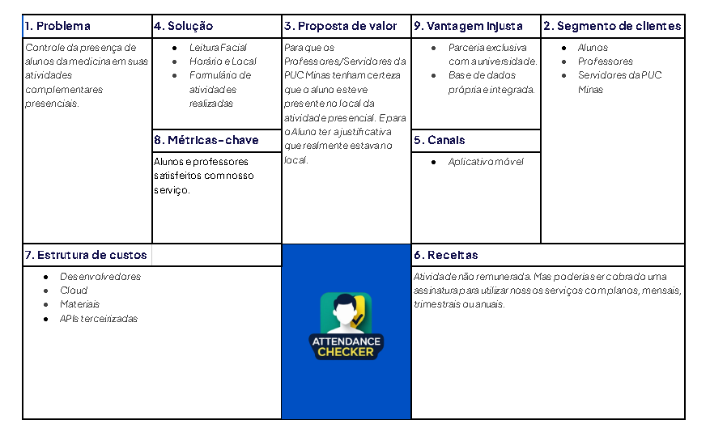
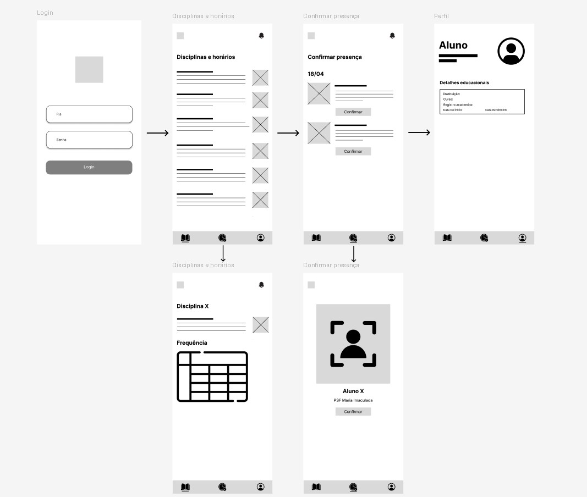
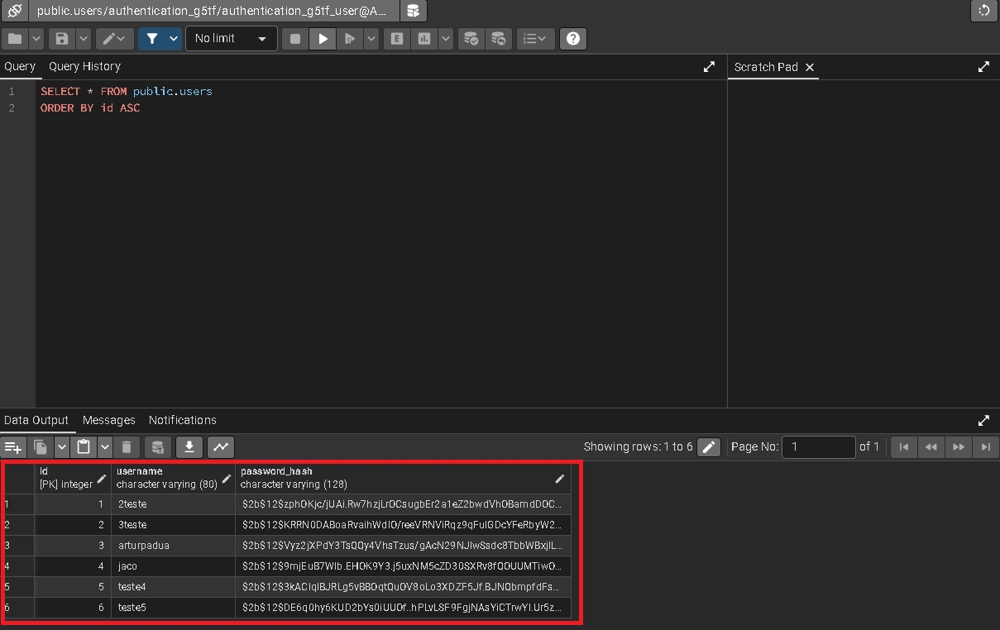
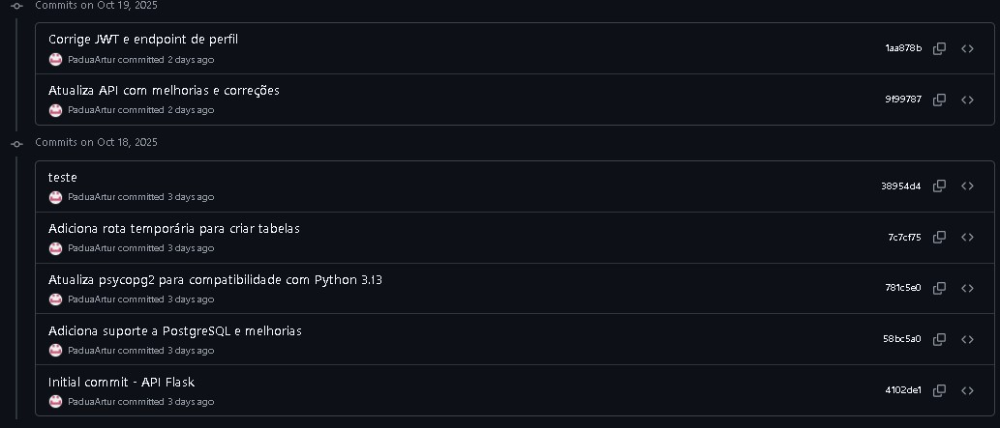
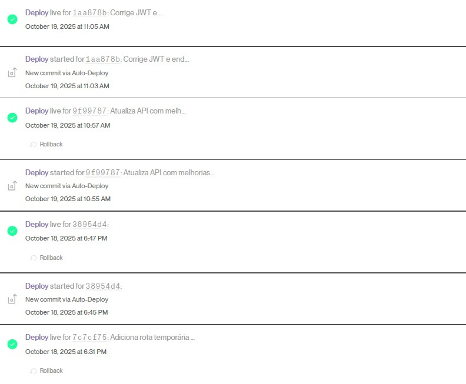

# 📌 Controle de presença de alunos

O projeto consiste no desenvolvimento de um sistema de controle de presença para alunos de Medicina em unidades de saúde. A solução utiliza geolocalização para confirmar que o aluno está no local correto e reconhecimento facial para validar sua identidade, garantindo maior segurança, confiabilidade e automação no processo de registro de presença.

---

## 👥 Integrantes

- Artur Carlo Costa Pádua - RA: 835298
- Gustavo Jacó - RA: 826466
- Enzo Batista Salerno - RA: 840527
- Diego Rodrigues Pereira Silva - RA: 824237
- João Victor Dias Ferreira - RA: 838133

---
# Etapas do projeto

## 1️⃣ Lean Canvas



## 2️⃣Requisitos


 

Requisitos Funcionais

| Prioridade | Requisito         | Descrição |
|-----------|------------------|-----------|
| Alta      | Autenticação por Login    | O sistema deve permitir autenticação do aluno via login (usuário/senha). |
| Alta    | Autenticação por Reconhecimento Facial    | Captura e processamento de imagem facial |
| Alta      | Registro de Presença   | O app deve registrar a confirmação de presença do aluno na unidade de prática |
| Alta    | Validação por Georreferenciamento   | Captura e processamento de imagem facial |
| Média     | Relatórios de Presença   | O sistema deve permitir ao administrador/professor visualizar relatórios de presença dos alunos |
| Média    | Gerenciamento de Usuários  | O sistema deve permitir cadastro e gerenciamento de alunos, professores e turmas |
| Média      | Gerenciamento de Unidades Externas    | O sistema deve possibilitar o gerenciamento de unidades externas (locais de prática) |
| Baixa    | Histórico de Presenças   |O app deve exibir ao aluno o histórico de presenças registradas |
| Baixa      | Sistema de Notificações    | O sistema deve enviar notificações para lembrar os alunos de confirmar a presença. |

Requisitos Não Funcionais
| Prioridade | Requisito         | Descrição |
|-----------|------------------|-----------|
| Alta    | Compatibilidade Multiplataforma   | Compatibilidade Multiplataforma |
| Alta      | Performance de Validação   | Processamento rápido de reconhecimento facial e Resposta ágil do georreferenciamento. |
| Média    | Escalabilidade   |O app deve conseguir lidar com muitos alunos ao mesmo tempo |
| Média  | Usabilidade    | A interface deve ser fácil de usar e clara |
| Baixa   | Modo Offline   | O app deve salvar dados mesmo sem internet e atualizar depois |

## 3️⃣Persona


## 👤 Persona 1 — Beatriz, 21 • 5º período • UBS/ESF (atenção básica)

**Quem é:**  
- Mora perto da UBS onde estagia.  
- Perfil colaborativo, tímida com chefias.  
- **Tecnologia:** Android intermediário (64GB), 4G irregular; usa WhatsApp/Drive; poupa bateria.  
- **Objetivo do estágio:** cumprir carga horária e registrar atuação por sala (vacinas, curativos, acolhimento).  

**Como valida presença hoje:**  
- Assina folha de ponto na recepção ou com o preceptor.  
- Se o preceptor está ausente, manda foto/mensagem em WhatsApp para “marcar presença”.  
- Troca de sala sem registro; às vezes anota em caderninho o horário para “não esquecer”.  

**Dores/dificuldades:**  
- Dependência do preceptor: se ele não aparece, ela sai sem assinatura.  
- Folhas físicas: podem sumir, molhar, ficar ilegíveis.  
- Ambiente fragmentado: várias salas → ninguém “vê” que estava presente em cada uma.  
- Conectividade fraca: quando tenta comprovar por mensagem, não envia na hora.  
- Falta de padronização: cada UBS tem um jeito (livro, planilha, assinatura em ficha).  

**Comportamentos/atalhos:**  
- Fotografa a folha assinada “por garantia”.  
- Chega mais cedo para “garantir” a assinatura com a recepção.  
- Mantém planilha pessoal com datas/horas.  

**Emoções e motivadores:**  
- Ansiedade quando depende de terceiros; medo de “perder o dia”.  
- Valoriza justiça e previsibilidade.  

**Frases gatilho:**  
- “Se a folha some, perco o dia.”  
- “Quando o preceptor atrasa, fico sem prova.”  

---

## 👤 Persona 2 — Rafaela, 26 • Internato (12º período) • UPA (plantão noturno)

**Quem é:**  
- Ágil, resolve no improviso; trabalha sob pressão.  
- Costuma fazer plantões extras e permutas.  
- **Tecnologia:** iPhone antigo, bateria fraca; usa modo economia; deixa dados móveis desligados quando pode.  
- **Objetivo do estágio:** cumprir e comprovar horas de plantão (inclusive permutas), sem gargalos.  

**Como valida presença hoje:**  
- Livro de ponto na portaria/segurança ou biometria no RH (em outro bloco).  
- Se dá erro, pede declaração assinada pelo médico responsável.  
- Planilha de escala impressa é referência para conferência posterior.  

**Dores/dificuldades:**  
- Biometria instável de madrugada; fila ou equipamento “fora do ar”.  
- Distância até o relógio → abandona o setor para registrar.  
- Permutas/horas extras não constam na escala impressa → presença impugnada.  
- Em baixa luminosidade, fotos/provas improvisadas ficam “inaceitáveis”.  

**Comportamentos/atalhos:**  
- Pede ao segurança para anotar no caderno quando a biometria cai.  
- Fotografa quadro de escala com mudanças do dia.  
- Deixa lembradores no celular para evitar esquecer o registro no fim do plantão.  

**Emoções e motivadores:**  
- Irritação com retrabalho; foco em eficiência.  
- Quer autonomia: “se eu vim e trabalhei, tem que constar.”  

**Frases gatilho:**  
- “De madrugada o relógio cai.”  
- “Se a troca não está na escala, não vale.”  

---

## 👤 Persona 3 — Mariana, 24 • 9º período • Pronto-Socorro (hospital-escola)

**Quem é:**  
- Organizada, “de processos”; pensa no currículo e em comprovações formais.  
- Circula por triagem, sutura, observação.  
- **Tecnologia:** Android bom; usa Drive, Docs e e-mail institucional; preocupa-se com privacidade (LGPD).  
- **Objetivo do estágio:** comprovar carga horária por setor e obter assinaturas regulares do preceptor.  

**Como valida presença hoje:**  
- Planilha (Google/Excel) semanal com horas declaradas; coleta assinatura do preceptor na sexta.  
- Alguns setores carimbam papel da evolução como “comprovante”.  
- Em divergência, troca e-mails com coordenação.  

**Dores/dificuldades:**  
- Escalas mutáveis: ementas/rodízios trocam em cima da hora e a planilha atrasada não reflete o dia.  
- Múltiplos setores no mesmo prédio → não há rastro de onde esteve.  
- Assinaturas acumuladas no fim da semana → preceptor está em cirurgia/curso e esquece.  
- Exposição de dados: planilhas compartilhadas com nomes, RA, horários, às vezes vazam em grupos.  

**Comportamentos/atalhos:**  
- Guarda comprovantes (foto do quadro de setores, e-mails).  
- Mantém cópia local da planilha e histórico em PDF.  
- Anota tarefas/atos por setor para embasar discussão se contestarem.  

**Emoções e motivadores:**  
- Busca confiabilidade documental; avessa a improviso.  
- Quer transparência: “quem acessou meus dados e por quê?”.  

**Frases gatilho:**  
- “Corro atrás de assinatura toda sexta.”  
- “Minha planilha vazou pro grupo.”

---


## 4️⃣Protótipo de baixa fidelidade


---

Vídeo das telas do prototipo inicial do aplicativo: https://youtube.com/shorts/grZxyR6Q9R8?feature=share
---
# ✅ Sprint 1
Nesta primeira sprint, foi implementado o sistema base de **autenticação** e **gerenciamento de usuários** do aplicativo. O projeto está dividido em duas camadas:  

- **Backend RESTful:** desenvolvido em Flask, hospedado na nuvem (Render)  
- **Aplicativo mobile:** desenvolvido em React Native com Expo  

O sistema permite que novos usuários se cadastrem através de uma tela de registro intuitiva, onde devem informar:  

- **Username:** mínimo de 3 caracteres  
- **Senha:** mínimo de 6 caracteres, com confirmação  

As senhas são criptografadas utilizando **bcrypt** antes de serem armazenadas no banco de dados **PostgreSQL**, garantindo a segurança das credenciais dos usuários.  

Após o cadastro, os usuários podem fazer login através de uma tela dedicada que valida as credenciais no backend. Quando autenticado, o sistema gera um **token JWT (JSON Web Token)** que é armazenado localmente no dispositivo móvel usando **AsyncStorage**. Este token é utilizado em todas as requisições subsequentes para identificar o usuário e proteger os endpoints da API.  

Além disso, foi desenvolvido o **módulo de reconhecimento facial**, que permite autenticar o aluno diretamente na unidade de saúde. Essa funcionalidade utiliza a câmera do dispositivo para comparar a face do usuário com o registro armazenado no sistema, garantindo:  

- **Identificação rápida**  
- **Segurança**  
- **À prova de fraudes**  

Essa etapa complementa a autenticação tradicional por senha, oferecendo uma camada adicional de segurança e praticidade ao processo de presença e login.


---
# ✅ Sprint 2
# O que foi feito

- Video Demonstração de como rodar o projeto no terminal e como funciona o reconhecimento facial(https://www.youtube.com/watch?v=5RnVo4YAB2k)

- Adicionado endpoint `/recognize_and_register` no backend Flask:
  - Recebe imagem do rosto, latitude, longitude e `courseId`
  - Usa `FaceRecognitionSystem` para reconhecer o aluno
  - Valida se o aluno está dentro do raio permitido da unidade (geofence)
- Criado mapa `COURSE_LOCATIONS` com coordenadas e raio por disciplina
- Implementada função `haversine_distance_m` para cálculo de distância em metros entre coordenadas

- Atualizada tela `FacialRecognitionScreen` no app Expo:
  - Uso do `expo-location` para obter latitude/longitude do aluno
  - Envio de `image + latitude + longitude + courseId` para o novo endpoint
  - Tratamento de respostas de sucesso/erro (face não reconhecida, fora da área, etc.)

  ## Motivação

Garantir que a presença por reconhecimento facial só seja registrada quando:
- o aluno for de fato reconhecido pelo modelo treinado
- o dispositivo estiver fisicamente dentro da área da instituição/sala definida

## Como testar

### Obs: Para rodar o projeto você terá que mudar os endereços IPs das páginas: HomeScreen.js, FacialRecognitionScreen.js, FaceRegistrationScreen.js, auth.js
### Você também deve estar logado na mesma rede do seu desktop.

Para descobrir seu ipv4 use "ipconfig" no terminal em qualquer diretório, se você tiver mais de um ipv4 use o do adaptador de rede WI-FI.

Para inserir uma nova localização vá até a pasta backend/units.json e adicione ou altere manualmente.

1. Iniciar o backend:
   cd C:\repos\icei-puc-minas-ppc-cc-tai2-022025-controle-de-presenca-de-alunos

# criar e ativar virtualenv (PowerShell)
python -m venv .venv
.\.venv\Scripts\Activate.ps1

# instalar dependências do backend
python -m pip install --upgrade pip
python -m pip install -r Backend\requirements.txt

# rodar servidor (a partir da raiz do repo)
uvicorn Backend.app:app --host 0.0.0.0 --port 5000 --reload

# alternativa (se quiser rodar de dentro da pasta Backend)
cd Backend
uvicorn app:app --host 0.0.0.0 --port 5000 --reload

2. Iniciar o app mobile:
   cd .\aplicacao_movel

# instalar pacotes JS
npm install

# instalar módulos nativos compatíveis com sua SDK Expo
npx expo install expo-image-picker expo-location

# iniciar Metro bundler (limpar cache)
npx expo start -c

3. No app:
   - Selecionar uma disciplina com `courseId` configurado em `COURSE_LOCATIONS`
   - Abrir a tela de reconhecimento facial
   - Autorizar câmera e localização
   - Tirar a foto próximo à coordenada configurada (para cair dentro do raio)

4. Esperado:
   - PR de sucesso quando rosto reconhecido + geolocalização válida
   - Mensagem de erro quando face não reconhecida ou fora do raio


### 🛠️ Tecnologias Utilizadas

#### Backend
- Python 3.11+  
- Flask 3.0 - Framework web  
- Flask-SQLAlchemy - ORM para banco de dados  
- Flask-JWT-Extended - Autenticação JWT  
- Flask-Bcrypt - Criptografia de senhas  
- Flask-CORS - Controle de CORS  
- PostgreSQL - Banco de dados em produção  
- Gunicorn - Servidor WSGI para produção  

#### Frontend (Mobile)
- React Native - Framework mobile  
- Expo SDK - Ferramentas de desenvolvimento  
- React Navigation - Navegação entre telas  
- Axios - Requisições HTTP  
- AsyncStorage - Armazenamento local  

---

### 📦 Dependências e Versões

#### Backend (Python/Flask)
- Flask==3.0.0  
- flask-cors==4.0.0  
- flask-jwt-extended==4.6.0  
- flask-sqlalchemy==3.1.1  
- flask-bcrypt==1.0.1  
- Werkzeug==3.0.0  
- gunicorn==21.2.0  
- psycopg2-binary==2.9.10  

#### Frontend (React Native/Expo)
- Node.js 18.x+  
- Expo ~52.0.0  
- React 18.3.1  
- React Native 0.76.3  
- React Navigation ^6.1.9  
- Axios ^1.6.2  
- AsyncStorage ^2.0.0  

---

### ✅ Como Rodar o Projeto

#### Instalação
```bash
# 1. Clone o repositório
git clone https://github.com/ICEI-PUC-Minas-PPC-CC/icei-puc-minas-ppc-cc-tai2-022025-controle-de-presenca-de-alunos.git

# 2. Entre na pasta do aplicativo
cd repositorio/aplicacao_movel

# 3. Instale as dependências
npm install


Aguarde.

### ▶️ Executar
```bash
# Inicie o servidor Expo
npx expo start
```

**Um QR CODE vai aparecer no terminal**

#### 📱 Abrir no Celular

#### iPhone:
1. Abra o app **Câmera** (padrão do iOS)
2. Aponte para o **QR code** no computador
3. Toque na notificação **"Abrir no Expo Go"**
4. Aguarde carregar (~30 segundos)

#### Android:
1. Abra o app **Expo Go**
2. Toque em **"Scan QR code"**
3. Aponte para o **QR code** no computador
4. Aguarde carregar (~30 segundos)

   **Celular e computador na mesma WiFi** - Necessário para o Expo Go se conectar ao servidor de desenvolvimento (Local)

###  Possiveis Problemas

#### Erro: "Network request failed"

**Causa:** Celular não está na mesma WiFi do computador

**Solução:**
1. Conecte ambos na mesma rede WiFi
2. Desative dados móveis (4G/5G) no celular
3. Reinicie: `npx expo start -c`

### Erro: "Module not found"

**Causa:** Dependências não instaladas corretamente

**Solução:**
```bash
git clone https://github.com/ICEI-PUC-Minas-PPC-CC/icei-puc-minas-ppc-cc-tai2-022025-controle-de-presenca-de-alunos.git
cd repositorio
cd aplicacao_movel
rm -rf node_modules package-lock.json
npm install
npx expo start -c
```

2. Execute o container Docker:
### QR Code não funciona

**Causa:** Rede com restrições de firewall

**Solução:**
```bash
docker-compose up
# Use modo túnel (mais lento, mas funciona)
npx expo start --tunnel
```

3. Acesse em: [http://localhost:3000](http://localhost:3000)

### Erro ao buscar perfil após login

**Causa:** API pode estar "dormindo" (plano free)


**Solução:**
- Aguarde 30 segundos e tente novamente
- Faça logout e login novamente

---
### 📷 Evidências visuais
---
Autenticação de login
---
https://youtu.be/y9RmpUm_UEs?si=LLMRP7r9g3bQpGXv
---
Reconhecimento facial
---
https://youtu.be/_UjlRTNaGJY?si=Ki7o8UpJncwrzuNN
---
Senhas no banco de dados 

---
Logs Deploy API de reconhecimento facial 


---
Sprint 2 reconhecimento 
https://www.youtube.com/watch?v=5RnVo4YAB2k

## 1. Funcionalidade: Registrar

| Identificador | Nome do teste | Objetivo | Entradas | Passos executados | Resultado esperado | Resultado obtido | Evidência | Status |
| :---: | :--- | :--- | :--- | :--- | :--- | :--- | :--- | :---: |
| **CT01** | Registro com sucesso | Verificar cadastro de novo usuário. | Dados válidos completos | 1. Preencher dados.<br>2. Clicar em Registrar. | Mensagem de sucesso e conclusão do registro. | **Mensagem de sucesso. Registro concluído.** | [Evidencia](docs/print_reg_sucesso.jpeg) | ✅ |
| **CT02** | Validação de confirmação de senha | Garantir que o campo de senha e confirmação sejam iguais. | Senhas diferentes | 1. Preencher senha X.<br>2. Preencher confirmação Y.<br>3. Registrar. | Erro informando divergência nas senhas. | **Mensagem "As senhas não coincidem".** | [Evidencia](docs/print_erro_senha.jpeg) | ✅ |
| **CT03** | Usuário duplicado | Impedir cadastro de nome de usuário já existente. | Usuário já cadastrado | 1. Preencher usuário existente.<br>2. Registrar. | Erro informando que o user já existe. | **Mensagem "Este nome de usuário já está em uso".** | [Evidencia](docs/print_user_dup.jpeg) | ✅ |
| **CT04** | Campos obrigatórios | Validar se todos os campos foram preenchidos. | Um ou mais campos vazios | 1. Deixar campos em branco.<br>2. Registrar. | Alerta para preencher todos os campos. | **Erro "Preencha todos os campos".** | [Evidencia](docs/print_campo_vazio.jpeg) | ✅ |
| **CT05** | Tamanho mínimo da senha | Validar segurança mínima da senha. | Senha com 5 caracteres | 1. Preencher senha curta.<br>2. Registrar. | Alerta sobre mínimo de caracteres. | **Mensagem "A senha deve ter no mínimo 6 caracteres".** | [Evidencia](docs/print_senha_curta.jpeg) | ✅ |

## 2. Funcionalidade: Login

| Identificador | Nome do teste | Objetivo | Entradas | Passos executados | Resultado esperado | Resultado obtido | Evidência | Status |
| :---: | :--- | :--- | :--- | :--- | :--- | :--- | :--- | :---: |
| **CT01** | Login com credenciais válidas | Verificar acesso ao sistema. | Usuário e Senha corretos | 1. Inserir dados corretos.<br>2. Clicar em Entrar. | Redirecionamento para a tela inicial. | **Redirecionado para Home.** | https://github.com/user-attachments/assets/4514db9a-7010-45c9-b2f9-f725003c487c | ✅ |
| **CT02** | Login com credenciais inválidas | Bloquear acesso com dados incorretos. | Senha ou usuário errados | 1. Inserir dados errados.<br>2. Clicar em Entrar. | Mensagem de erro de credenciais. | **Mensagem "Credenciais inválidas".** | https://github.com/user-attachments/assets/6b12fcf1-8f3f-480c-877c-e3415656fc68 | ✅ |
| **CT03** | Teste de SQL Injection | Verificar segurança contra injeção de código básico. | `' OR '1'='1` | 1. Inserir código SQL no campo.<br>2. Clicar em Entrar. | Sistema deve tratar como texto e negar acesso. | **Comando tratado como texto comum. Mensagem "Credenciais inválidas".** | https://github.com/user-attachments/assets/3c40bef6-db86-4f38-9620-49c1a4416be5 | ✅ |

## 3. Funcionalidade: Reconhecimento Facial (Cadastro e Presença)

**Lógica:** 1. O usuário faz Login (Senha) -> App pede foto do rosto para cadastrar.
2. Futuramente, ao clicar em "Registrar Presença", o app compara o rosto atual com a foto cadastrada.

| Identificador | Nome do teste | Objetivo | Entradas | Passos executados | Resultado esperado | Resultado obtido | Evidência | Status |
| :---: | :--- | :--- | :--- | :--- | :--- | :--- | :--- | :---: |
| **CT01** | Cadastro inicial da face | Verificar se o sistema solicita e salva a foto do rosto logo após o primeiro login. | Credenciais válidas<br>Rosto visível | 1. Fazer login com usuário/senha.<br>2. Na tela "Cadastre seu Rosto", permitir câmera.<br>3. Tirar foto do rosto. | O sistema deve salvar a foto, exibir mensagem de "Face Cadastrada" e liberar o uso do app. | Cadastro criado com sucesso, Foto armazenada para o usuario | https://github.com/user-attachments/assets/890bcbf2-dce3-400a-b9ef-ce924e753648 | ✅ |
| **CT02** | Validação de Presença com sucesso | Verificar se o sistema confirma a presença comparando com a foto cadastrada. | Rosto do próprio usuário | 1. Acessar menu "Presença".<br>2. Clicar em "Confirmar Presença".<br>3. Posicionar rosto na câmera. | O sistema deve reconhecer a face e exibir "Presença Confirmada". | Foto validada, segue o fluxo para confirmação de presença. cruzando informações junto com o reconhecimento facia | https://github.com/user-attachments/assets/c92c3883-368b-4b51-8ce0-0e9db2166dad | ✅ |
| **CT03** | Validação por terceiro (Fraude) | Verificar se o sistema bloqueia presença se outra pessoa tentar validar pelo usuário. | Rosto de outra pessoa | 1. Usuário A está logado.<br>2. Usuário B tenta validar a presença na câmera. | O sistema deve exibir "Rosto não correspondente" ou "Falha na validação". | Rosto não reconhecido | https://github.com/user-attachments/assets/52dc4988-da6d-445b-a077-f51c87b88a54 | ✅ |


## 4. Funcionalidade: Geolocalização

| Identificador | Nome do teste | Objetivo | Entradas | Passos executados | Resultado esperado | Resultado obtido | Evidência | Status |
| :---: | :--- | :--- | :--- | :--- | :--- | :--- | :--- | :---: |
| **CT01** | GPS Desligado | Verificar tratamento quando o sensor de localização está desativado no aparelho. | GPS do celular: Desligado | 1. Garantir que a localização (GPS) do celular esteja desligada.<br>2. Tentar realizar a validação de presença. | O sistema deve identificar que o GPS está desligado e exibir um alerta/popup solicitando a ativação. | Pede que ligue a localização do dispositivo. Não deixa avançar até que a localização esteja ligada.| https://github.com/user-attachments/assets/ecfd84cc-a048-4d98-ae10-3da78eec9200 | ✅ |
| **CT02** | Presença dentro do perímetro (Localização Válida) | Validar se o sistema aceita a presença quando o usuário está fisicamente no local correto (ex: Campus PUC). | Coordenadas GPS dentro do raio da universidade | 1. Estar fisicamente na universidade (ou simular coordenadas correta).<br>2. Clicar em "Confirmar Presença". | O sistema deve validar a localização e prosseguir para o reconhecimento facial ou mensagem de sucesso. | Foto validada, segue o fluxo para confirmação de presença. cruzando informações junto com o reconhecimento facial|https://github.com/user-attachments/assets/9f2c9a79-6377-4844-bb78-378a4f51736e| ✅ |
| **CT03** | Presença fora do perímetro (Localização Inválida) | Impedir que o usuário registre presença estando longe do local permitido. | Coordenadas GPS distantes do local ( > 80m) | 1. Estar longe do local de aula.<br>2. Tentar clicar em "Confirmar Presença". | O sistema deve bloquear a ação e exibir mensagem: "Fora do local permitido". | Erro: fora do local permitido, distancia > 80| https://github.com/user-attachments/assets/1b61644f-7610-4ab0-b51a-6446a0e2023e | ✅ |


## 🧭 Diário de Bordo

### 📅 Reuniões Semanais

| Data       |     Participantes     |                                      Principais Tópicos                                                   | Decisões Tomadas | Encaminhamentos     |
|------------|-----------------------|-----------------------------------------------------------------------------------------------------------|------------------|---------------------|
| 19/08/2025 | Artur, Gustavo, Enzo  | Estruturar o projeto e preencher o Lean Canvas, definindo problemas, soluções, público-alvo e estratégias | Validado Canvas  | Decidir as tecnologias ideais para o desenvolvimento do projeto e como o projeto será desenvolvido. |
| 02/09/2025 | Artur, Gustavo, Enzo  | Estruturar o Kanban com tarefas na ordem de importância e para fácil entendimento do grupo | Validado Kanban e levantamento de requisitos  | Ordem definida por dependências técnicas: BD → Servidor → Auth → Funcionalidades |
| 09/09/2025 | Artur, Gustavo, Enzo  | Criar persona e mapa de empatia | Validado mapa de empatia e persona | Estruturação da proposta do projeto com base no mapa de empatia e persona criadas |

### 📦 Entregas

| Entrega       | Data       | Descrição                              | Status     | Link |
|---------------|------------|----------------------------------------|------------|------|
| Entrega 1     | 19/08/2025 | Lean Canvas + Justificativa do Problema | ✅ Entregue | [Lean Canvas - Controle de Presença de Alunos](docs/LeanCanvas(Controle_de_presenca_de_alunos).pdf)
| Entrega 2     | 02/09/2025 | Kanban + levantamento de requisitos          | ✅ Entregue | [Kanban  ](https://github.com/orgs/ICEI-PUC-Minas-PPC-CC/projects/127/views/1?template_dialog_tab=featured&system_template=kanban) [Requisitos](docs/Requisitos2.pdf)|
| Entrega 3     | 09/09/2025 | Persona + Mapa de empatia         | ✅ Entregue | [Persona  ](docs/Personas.pdf) [Mapa de Empatia](docs/Mapa_de_Empatia.png)|

### 🧩 Tarefas Pendentes

- [ ] Georreferenciamento
- [ ] Georreferenciamento com o reconhecimento facial, para precisão da presença


---

## 🛠️ Problemas Enfrentados

### Problema 1: Conflito de Horários para Reunião
- **Descrição:** Dois integrantes estavam indisponíveis nos horários definidos inicialmente.
- **Solução:** Adotamos a plataforma When2Meet para reorganizar os horários com mais flexibilidade.


---

## 🗣️ Feedbacks Recebidos

| Data       | De Quem     | Observação                                                                 | Ação Tomada                       |
|------------|-------------|-----------------------------------------------------------------------------|----------------------------------|
| 26/08/2025 | Professor X | Melhorar justificativa do problema, estava genérica                        | Redefinimos o problema com base em dados reais coletados |
| 10/09/2025 | Colega Y    | Interface não estava intuitiva em telas menores                            | Responsividade ajustada com Flexbox e Media Queries |

---

## 🚀 Funcionalidades do Projeto para o aluno

- [ ] Check-in e Check-out
- [ ] Cadastro de Usuários
- [ ] Histórico de Presenças
- [ ] Calendário integrado sobre plantões, tarefas e atividades

## 🚀 Funcionalidades do Projeto para o professor

- [ ] Lista de presenças em tempo real
- [ ] Relatórios rápidos no app sobre a frenquencia dos alunos
- [ ] Histórico de Presenças
- [ ] Notificações de alerta se algum aluno tentar burlar o check-in
      
## 🚀 Funcionalidades do Projeto para a administração

- [ ] Gestão de usuários para novos alunos/professores
- [ ] Exportação de relatórios em PDF sobre o aplicativo em geral

---

## 📚 Lições Aprendidas

- Importância de planejamento incremental
- Uso prático do Git em equipe
- Comunicação eficiente em times multidisciplinares
- Documentação e comunicação evitam problemas futuros

---

## 📁 Organização do Repositório

```
projeto/
├── Backend/
├── aplicacao_movel/
├── docs/
│   ├── Logs_api.pdf
│   ├── Mapa_de_Empatia.png
│   ├── Personas.pdf
│   ├── Requisitos2.pdf
│   ├── bd_hash.jpg
│   ├── documento.md
│   ├── lean_canvas.png
│   ├── logs.jpg
│   ├── logs_deploy.jpg
│   ├── sprint1.pdf
│   └── wireframe.jpg
├── reconhecimento_facial/
├── src/
├── venv/
├── .gitattributes
├── .gitignore
├── Dockerfile
├── README.md
├── package-lock.json
└── package.json
```

---

## 📝 Licença

Este projeto é licenciado sob a Licença MIT. Veja o arquivo [LICENSE](./LICENSE) para mais detalhes.
